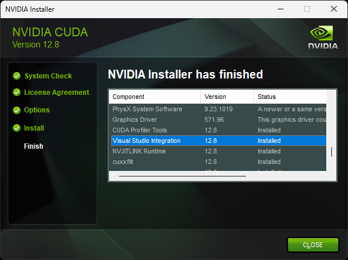

# Installation & Building

## Prerequisites

- Git
- CMake (3.22.1 or higher)
- C++ compiler with C++20 support (MSVC 17+, gcc 11+ or clang 12+)
- Python 3.12+ (if bindings are used)
- NVIDIA CUDA Computing Toolkit v12+ (if building with CUDA support)

## Supported Operating Systems

- Windows
- macOS
- Linux

## Supported architectures

PCCL aims to be compatible with all architectures. While specialized kernels exist to optimize crucial operations like
CRC32 hashing and quantization, fallback to a generic implementation should always be possible.
Feel free to create issues for architecture-induced compilation failures.

### Explicitly supported are:

- x86_64
- aarch64 (incl. Apple Silicon)

## Building

### Installing prerequisites

In this section we propose a method of installing the required prerequisites for building PCCL on Windows, macOS and
Linux.

#### Windows

With the winget package manager installed & up-to-date from the Microsoft Store, you can install the prerequisites as
follows:

```bash
winget install Microsoft.VisualStudio.2022.Community --silent --override "--wait --quiet --add ProductLang En-us --add Microsoft.VisualStudio.Workload.NativeDesktop --includeRecommended"
winget install Git.Git --source winget
winget install Kitware.CMake --source winget
winget install Python.Python.3.12 --source winget # (if you want to use the Python bindings)
```

After installing these packages, make sure to refresh your PATH by restarting your explorer.exe in the Task Manager and
opening a new Terminal launched by said explorer.

##### Installing CUDA on Windows

Go to https://developer.nvidia.com/cuda-downloads and download & click through the CUDA Toolkit installer.

**CAUTION:** It is crucial to do this installation process *after* installing Visual Studio because the installer will
install the "Visual Studio Integration" only if VisualStudio is installed
at the point of running the installer.
If you just freshly installed Visual Studio and still have an old CUDA Toolkit installation lying around, you will have
to uninstall and reinstall CUDA afterwards.
Make sure "Visual Studio Integration" is status "Installed" in the summary of the installer.
Without the Visual Studio Integration of the CUDA Toolkit, the cmake generation phase will fail in a specific way that
is documented in the build section below.



#### macOS

```bash
xcode-select --install # if not already installed

# install Homebrew package manager if not already installed
/bin/bash -c "$(curl -fsSL https://raw.githubusercontent.com/Homebrew/install/HEAD/install.sh)"

brew install git # if not already installed by xcode command line tools
brew install cmake
brew install python@3.12 # (if you want to use the Python bindings)
```

We recommend using python distributions from Homebrew to avoid conflicts with the system python
and additionally because Homebrew python is built to allow attachment of debuggers, such as lldb and gdb
to debug both python and native code end to end.

#### Ubuntu

```bash
sudo apt update
sudo apt install -y build-essential
sudo apt install -y git
sudo apt install -y cmake

# (if you want to use the Python bindings)
sudo apt install -y python3.12 python3.12-venv python3-pip

```

##### Installing CUDA (if not already installed)

The NVIDIA CUDA Computing Toolkit can be installed using any prevalent method as long as `nvcc` ends up in the system
`PATH`
of the shell that performs the cmake build.

###### Install using nvidia provided apt repository

This is the recommended way to install the CUDA toolkit on Ubuntu.
If you do not have a good reason to deviate from this (such as custom drivers, as the p2p geohot driver), you should
likely stick to this method.

Go to https://developer.nvidia.com/cuda-downloads and follow the instructions provided.

###### Install using .run file (not recommended on Ubuntu)

It is also possible to install CUDA via the NVIDIA provided .run file.
This is not the recommended way to install cuda, but there may be good reasons why not to use the system packages,
such as using a custom-built nvidia driver, such as the p2p geohot driver.
Any nvidia driver related package such as userspace libraries and the CUDA toolkit may bring kernel module dependencies
which may be undesirable. When installing via this method, carefully validate the "kernel-module-version-like
designation" (e.g. "565.57.01")
of 1.) Your cuda installation against the that of your installed driver and 2.) Your installed userspace libraries.
Your userspace libraries and kernel modules must match EXACTLY, whereas for cuda distributions the driver version must
merely exceed the minimum stated by the distribution.
Note that the .run file may replace your driver & user space library installation, if not explicitly disabled and can
conflict with installed nvidia apt packages.
Also note that seemingly innocent packages such as nvitop will bring in nvidia related apt dependencies which can result
in
broken system state and conflicts with your existing driver/userspace libraries/cuda libraries installation when using
the .run file method.
Use this method with caution and be aware that many packages are operating under the assumption that you are missing
dependencies!

```
# search for "Driver Version" to find e.g. "565.57.01"; Ensure this matches everywhere.
nvidia-smi

# check version postfix to validate userspace library installation, e.g. "libnvidia-ml.so.565.57.01" -> "565.57.01"; this must match your driver version exactly.
ls /usr/lib/x86_64-linux-gnu/ | grep libnvidia-ml.so

# download cuda .run file; ensure the driver version is higher or equal to the designation, here (driver+userspacelibs) "565.57.01" > (cuda) "560.35.05", hence ok.
wget https://developer.download.nvidia.com/compute/cuda/12.6.3/local_installers/cuda_12.6.3_560.35.05_linux.run
sudo bash cuda_12.6.3_560.35.05_linux.run

# finally, add /usr/local/cuda/bin to $PATH with your method of choice. nvcc should be invokable from the shell used for building.
```

### Building the native library & other targets

To build all native targets, run the following commands valid for both Windows with PowerShell and Unix-like systems
starting from the root directory of the repository:

```bash
git submodule update --init --recursive
mkdir build
cd build
cmake -DCMAKE_BUILD_TYPE=Release -DPCCL_BUILD_CUDA_SUPPORT=ON .. # use -DPCCL_BUILD_CUDA_SUPPORT=OFF if building without cuda support
cmake --build . --config Release --parallel
```

**CAUTION:** When building on Windows, make sure to use the "x64 Native Tools Command Prompt for VS 2022". Make sure it
is specifically the 'x64' variant!

If you are getting the following error on **Windows**, the Visual Studio Integration from CUDA is missing, which is an
indication that CUDA was installed BEFORE
VisualStudio/MSVC was installed on the system:

```
-- CUDA Toolkit was found!
CMake Error at C:/Program Files/CMake/share/cmake-3.31/Modules/CMakeDetermineCompilerId.cmake:614 (message):
  No CUDA toolset found.
Call Stack (most recent call first):
  C:/Program Files/CMake/share/cmake-3.31/Modules/CMakeDetermineCompilerId.cmake:8 (CMAKE_DETERMINE_COMPILER_ID_BUILD)
  C:/Program Files/CMake/share/cmake-3.31/Modules/CMakeDetermineCompilerId.cmake:53 (__determine_compiler_id_test)
  C:/Program Files/CMake/share/cmake-3.31/Modules/CMakeDetermineCUDACompiler.cmake:131 (CMAKE_DETERMINE_COMPILER_ID)
  CMakeLists.txt:10 (enable_language)
```

In this case, the CUDA Toolkit needs to be uninstalled and reinstalled while ensuring the Visual Studio integration is
installed.
Refer to section "Installing CUDA on Windows" for more information.

### Recommended way to use the pccl native library

The recommended way to use PCCL in a C/C++ project is to clone the PCCL repository and link against the pccl library in
CMake:

```bash
git clone --recurse https://github.com/PrimeIntellect-ai/pccl.git
```

Then add the newly cloned repository as a subdirectory in your CMakeLists file:

```cmake
add_subdirectory(pccl)
```

Then link against the pccl library

```cmake
target_link_libraries(YourTarget PRIVATE pccl)
```

### Installing the Python Package locally

To install the Python package locally, starting from the root directory of the repository, run the following commands:

```bash
git submodule update --init --recursive # if not done already
```

#### Optionally create a virtual environment.

NOTE: Sometimes this may even be REQUIRED on certain distributions when using system python

```bash
cd python
python -m venv venv # on Linux, "python3"/"python3.12" may be required instead of "python"
```

To activate the virtual environment, depending on your operating system and shell, run one of the following commands:

```ps1
# on Windows with PowerShell
.\venv\Scripts\Activate.ps1
```

NOTE: `Set-ExecutionPolicy -ExecutionPolicy AllSigned -Scope CurrentUser` and choosing `A` for "Always Run" may be
required to run the script.

```batch
# on Windows with cmd
.\venv\Scripts\activate.bat
```

```bash
# on Unix-like systems
source venv/bin/activate
```

Then build and install the package from source:

```
pip install framework/ # make sure not to forget the trailing slash
```

To test the installation, run the following command valid for both Windows with PowerShell and Unix-like systems:

```bash
python -c 'import pccl; print(pccl.__version__)'
```

## Testing

### C++ Tests

To run the C++ unit tests, starting from the root directory of the repository, run the following commands valid for both
Windows with PowerShell and Unix-like systems:

```bash
cd build
ctest --verbose --build-config Release --output-on-failure
```

### Python Tests

To run the python unit and end-to-end tests, starting from the root directory of the repository, run the following
commands:

```bash
cd python/tests

# Run unit tests
cd ../unit_tests
pip install -r requirements.txt # install requirements for unit tests
python -m pytest -s

# Run end to end tests
cd end_to_end
pip install -r requirements.txt # install requirements for e2e tests
python -m pytest -s

# If you want to run pytorch only tests / numpy only tests, make sure
# to uninstall numpy or pytorch respectively before running the tests
cd ../pytorch_only_tests
pip install -r requirements.txt # install requirements for pytorch only tests
pip uninstall -y numpy
python -m pytest -s

cd ../numpy_only_tests
pip install -r requirements.txt # install requirements for numpy only tests
pip uninstall -y torch
python -m pytest -s

# Recommended: re-install both numpy and pytorch after running the tests
pip install numpy torch
```